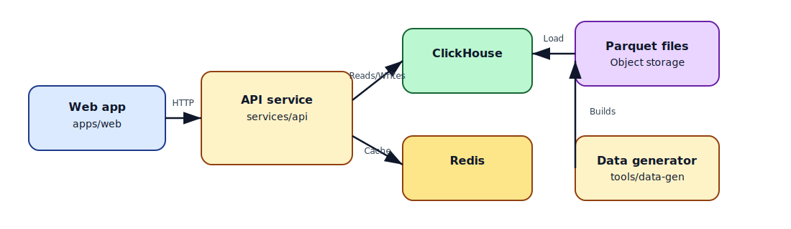

# Pivot Experiment

High-performance financial data pivot table platform built with Rust and ClickHouse.



## Overview

Pivot Experiment enables real-time analysis of large-scale financial trade data across multiple dimensions:

- **Organizational hierarchy**: Portfolio Manager → Fund → Portfolio → Desk → Book
- **Instrument breakdown**: Asset Class → Product Type → Symbol
- **Geographic view**: Region → Country → Venue
- **ETF/ETC look-through**: See underlying constituent exposures

## Features

- **High-performance OLAP**: ClickHouse backend optimized for analytical queries
- **Composite instrument support**: ETFs, ETCs with constituent breakdown
- **Synthetic data generation**: Realistic trade data for testing
- **Multi-dimensional pivoting**: Flexible aggregation across any dimension
- **Pre-computed rollups**: Fast dashboard queries

## Quick Start

```bash
# Start infrastructure (ClickHouse + Redis)
docker compose up -d

# Initialize database schema
pnpm db:reset
pnpm db:rollups

# Generate sample data (10K trades with constituent expansion)
cargo run -p pivot-data-gen --release -- \
  --rows 10000 \
  --explode-constituents \
  --output sample_trades.csv \
  --instruments-output instruments.csv \
  --constituents-output constituents.csv

# Run the API server
pnpm dev:api
```

## Project Structure

```
pivot-experiment/
├── apps/
│   └── web/              # React web application
├── services/
│   └── api/              # Rust API server
├── tools/
│   └── data-gen/         # Synthetic data generator
├── sql/
│   └── clickhouse/       # Database schemas
├── docs/                 # Documentation
└── docker-compose.yml    # Local infrastructure
```

## Data Generator

Generate realistic financial trade data with support for ETF/ETC constituent explosion:

```bash
# Basic usage
cargo run -p pivot-data-gen -- --rows 1000 --output trades.csv

# With constituent look-through
cargo run -p pivot-data-gen -- \
  --rows 1000 \
  --explode-constituents \
  --output trades.csv

# Full reference data export
cargo run -p pivot-data-gen -- \
  --rows 5000 \
  --portfolio-managers 20 \
  --explode-constituents \
  --output trades.csv \
  --instruments-output instruments.csv \
  --constituents-output constituents.csv
```

### Options

| Option | Default | Description |
|--------|---------|-------------|
| `--rows, -r` | 1000 | Number of trades to generate |
| `--portfolio-managers, -p` | 10 | Number of portfolio managers |
| `--output, -o` | stdout | Output file path |
| `--seed, -s` | 42 | Random seed for reproducibility |
| `--explode-constituents` | false | Expand ETF/ETC trades to constituent rows |

### Instruments Included

| Type | Count | Examples |
|------|-------|----------|
| Stocks | 15 | AAPL, MSFT, GOOGL, AMZN, NVDA, TSLA |
| ETFs | 4 | SPY, QQQ, XLF, XLE |
| ETCs | 4 | GLD, SLV, USO, PMET |
| Commodities | 6 | GOLD, SILVER, CRUDEOIL |

## Documentation

- [Getting Started](docs/getting-started.md) - Step-by-step data generation guide
- [Data Model](docs/data-model.md) - Schema design and query patterns
- [Data Generator](docs/data-generator.md) - CLI usage and options
- [Large-Scale Generation](docs/large-scale-data-generation.md) - Generating 20M+ rows
- [Project Roadmap](docs/roadmap.md) - Delivery plan and next steps

## Tech Stack

| Component | Technology |
|-----------|------------|
| API Server | Rust |
| Database | ClickHouse |
| Cache | Redis |
| Web App | React + TypeScript |
| Package Manager | pnpm |

## Scripts

| Command | Description |
|---------|-------------|
| `pnpm dev:api` | Run API server |
| `pnpm dev:web` | Run web application |
| `pnpm gen:data` | Generate sample data |
| `pnpm db:reset` | Initialize ClickHouse schema |
| `pnpm db:rollups` | Create rollup tables |

## License

MIT
