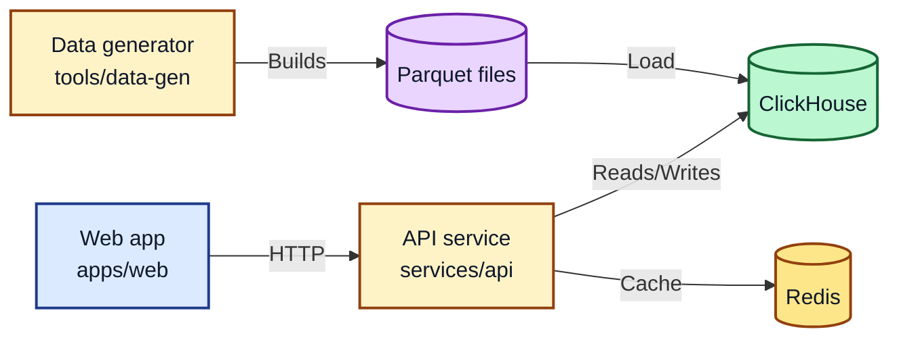

# Plan README

## Current status

- Rust workspace with a minimal API service (`services/api`) and data generator (`tools/data-gen`).
- Web app scaffold in `apps/web` with a placeholder dev script.
- Local infrastructure in `docker-compose.yml` for ClickHouse and Redis.

## Architecture diagram

## Near-term plan

1. Implement API routes for query and pivot operations.
2. Build a basic web UI to request and visualize pivots.
3. Add integration with ClickHouse and Redis.
4. Expand test coverage with unit and integration tests.
